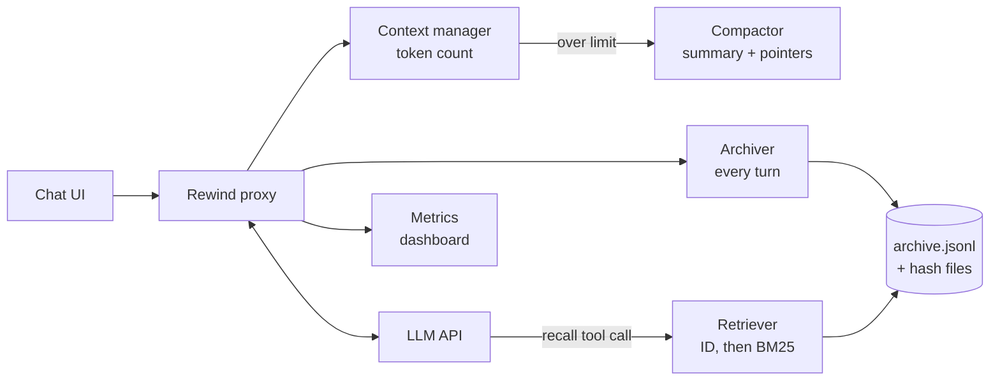

# Rewind: Hackathon Plan

2026-09-18 · Live version: https://claude.ai/code/artifact/5b9daa77-c09c-4aa0-905b-3a8265c821dc

## Overview

**Pitch:** When a chatbot compacts its context, it forgets. Rewind archives everything it drops, recalls it for a few tokens, and shows the money saved, live.

**Problem.** When a model's context window fills up, compaction replaces old turns with a summary. Exact details such as code, numbers, names and decisions are lost. When they are needed again, the model regenerates them, paying expensive output tokens and often getting them wrong.

**What Rewind does.** Rewind is a small proxy between a chat app and the LLM API:

- Before compaction, it archives the turns that are about to be dropped, word for word.
- It leaves short pointers (such as `§a3f9 → auth function`) in the compaction summary.
- It gives the model a `recall` tool that fetches archived content by ID, falling back to keyword search.
- If nothing relevant is found, the model is told to generate the content fresh.

**Goal:** less token spend and better use of the context window, shown with live numbers on screen.

## Background and our angle

The core mechanism (archive what's evicted, recall it later) already exists. Rewind's angle is **total cost per task**, measured and shown live, with any model.

| System | What it does | Relation to Rewind |
| --- | --- | --- |
| [ARC](https://arxiv.org/html/2607.25066) (2026) | Append-only store with hash IDs; compaction leaves citations; agent calls `_recall §id`. 99.4–99.8% needle accuracy vs 79.6–96.7% for RAG. | Closest prior work. Covers tool outputs only, tested on Qwen3. |
| [MemGPT / Letta](https://medium.com/@wasowski.jarek/i-compared-5-ai-agent-memory-systems-across-6-dimensions-none-wins-6a658335ed0a) | OS-style memory tiers; the model pages data in and out with function calls. | Same concept, general-purpose agent framework. |
| [TokenPilot](https://arxiv.org/pdf/2606.17016) (2026) | Cache-friendly compaction and eviction based on remaining usefulness. | Covers cache-aware compaction, which is a stretch goal for us. |
| [Zep / Graphiti](https://arxiv.org/abs/2501.13956) | Knowledge graph that records when each fact was true. | Best for facts that change; out of scope for the hackathon. |
| [Mem0](https://mem0.ai/blog/context-compression-vs-memory-in-ai-agents) | LLM extracts facts into a vector store. | Extracted facts lose accuracy compared with verbatim text. |

[Verbatim Chunks Beat Extracted Artifacts](https://arxiv.org/abs/2601.00821) found raw conversation chunks beat extracted facts by 15.9 points on LoCoMo and 22 points on LongMemEval. This supports storing the original text.

**What we can credibly claim for the hackathon:**

- A working proxy that combines verbatim archiving, ID-based recall, gist-first recall and a "generate new" threshold.
- A live, side-by-side measurement of tokens and cost against plain compaction.
- Works with any model through the proxy; not tied to one framework.

## Demo experience

Two chats run side by side on the same scripted conversation, with an 8k-token context limit so compaction happens within minutes.

|  | Left: plain compaction | Right: Rewind |
| --- | --- | --- |
| On compaction | Summarizes old turns; details are lost | Archives old turns word for word and leaves `§id` pointers |
| Asked for an earlier detail | Guesses or regenerates it | Calls `recall(§id)` and returns the exact original, highlighted |
| Cost of that answer | Hundreds to thousands of output tokens | Tens of input tokens |

**Live dashboard under the chats:**

- Tokens used by each side, over time
- Estimated cost of each side
- Recall hits and misses
- A timeline of compaction events and what was archived

**The key moment:** "Left spent 2,400 output tokens rewriting the function and got it wrong. Right spent 60 tokens recalling it exactly." Use your own measured numbers in the real demo.

## MVP scope

Build six pieces, with no database: files and in-memory search are enough for the demo.

**Build:**

- [ ] **Proxy** (FastAPI): counts tokens and triggers compaction at the limit
- [ ] **Archive**: append-only `archive.jsonl` plus content files named by hash (automatic deduplication)
- [ ] **Compactor**: summarizes old turns and writes a pointer table (`§id → one-line gist`) into the summary
- [ ] **`recall` tool**: fetches by ID, falls back to BM25 search; returns the gist first and the full text on request
- [ ] **"Generate new" rule**: if the best search score is below a threshold, tell the model to generate fresh
- [ ] **Frontend**: two chat panes and a live token and cost chart

**Skip for the hackathon (mention as roadmap):**

- Vector embeddings (BM25 is enough for exact details like code and numbers)
- Cache-aware compaction
- Multiple users and sessions
- Value-based eviction scoring

**Storage interface:** keep all storage behind `put`, `get_by_id` and `search`. Moving to SQLite later is then a one-class change.

## Architecture

The proxy sits between the chat UI and the LLM API; every turn is archived as it happens, so compaction can never lose data.

**Recall order when the model needs a detail:**

1. **Context window**: the model already sees it.
2. **Recall by ID**: a pointer in the summary leads to an exact fetch.
3. **BM25 search**: used when there is no pointer.
4. **Below the score threshold**: treat the request as new and generate fresh.

**Archive record** (one line in `archive.jsonl`): `id`, `session`, `turn_range`, `role`, `type` (code, text, tool output), `gist`, `timestamp`, `in_context`.

## Timeline

The plan assumes a 36-hour hackathon; for 24 hours, drop the gist-vs-full levels and use Streamlit.

| Hours | Deliverable | Done when |
| --- | --- | --- |
| 0–4 | Chat loop, token counter, baseline compaction | Left pane compacts at 8k tokens |
| 4–10 | Archive, pointer summaries, `recall` tool | Model recalls a planted fact by ID |
| 10–16 | BM25 fallback, threshold rule, gist vs full levels | Recall works without a pointer; misses say "generate new" |
| 16–24 | Split-screen UI and live metrics chart | Both panes and the chart update each turn |
| 24–30 | Scripted demo with 3–4 planted facts; measure the numbers | Repeatable run with recorded token and cost figures |
| 30–36 | Polish, 3-minute pitch, backup demo video | Pitch rehearsed twice; video saved offline |

## Tech stack

| Layer | Choice | Why |
| --- | --- | --- |
| Backend | Python, FastAPI | Fast to build; good LLM SDKs |
| Keyword search | `rank_bm25` | Handles exact identifiers, code and numbers |
| Token counting | Provider's token counter, or `tiktoken` as an estimate | Drives the compaction trigger and the dashboard |
| Storage | `archive.jsonl` + hash-named files | No setup; judges can open and inspect it |
| Model | Claude Opus 5 by default (or a cheaper model such as Haiku 4.5, your call), same on both sides | Keeps the comparison fair and the budget low |
| Frontend | Streamlit (quick) or React + Recharts (polished) | Two chat panes and a live chart |

## Stretch goals and roadmap

Pick at most one stretch goal during the hackathon; the rest go on the roadmap slide.

- **MCP server**: expose `recall` so it works inside Claude Code and other agents. Pitch line: "install it in one line and your agent stops forgetting."
- **Output reuse**: when a request matches earlier output, return the stored output instead of regenerating it. Output tokens usually cost several times more than input tokens.
- **Cache-friendly compaction**: keep the prompt prefix stable and show the cache hit rate on the dashboard.
- **After the hackathon**: vector search alongside BM25, value-based eviction, SQLite storage, multi-user isolation, and a cost-per-task benchmark.

## Pitch and demo script

The 3-minute pitch: problem, live proof, numbers, next step.

| Time | Beat |
| --- | --- |
| 0:00–0:30 | Problem: "Chatbots forget after compaction, then pay to regenerate what they forgot." |
| 0:30–1:45 | Live demo: run the scripted chat, trigger compaction, ask for a planted detail. Left guesses; right recalls it exactly. |
| 1:45–2:15 | Dashboard: tokens and cost saved, recall hit rate. |
| 2:15–2:45 | Credibility: ARC and MemGPT show the problem is real; our angle is cost per task, with any model. |
| 2:45–3:00 | Next step: MCP server so any agent can use it. |

**Planted facts for the script:** a short code function, an exact number (a price or limit), a person's name and role, and a decision with its reason.

## Risks and open questions

| Risk | Fallback |
| --- | --- |
| Live API slow or down during the demo | Pre-recorded backup video; cached replay of the scripted run |
| Model doesn't call `recall` when it should | Stronger tool description; auto-inject pointers when the query matches a gist |
| Irrelevant recall confuses the model | Raise the score threshold; return the gist before the full text |
| Savings look small in a short demo | Plant larger artifacts (long functions) so regeneration is clearly expensive |

- [ ] How long is the hackathon, and is there a theme or required tech?
- [ ] Team size and who owns backend vs frontend?
- [ ] Which LLM provider and how much API credit is available?

## Sources

- [Addressable Recall Compaction (ARC), arXiv 2607.25066](https://arxiv.org/html/2607.25066)
- [Verbatim Chunks Beat Extracted Artifacts, arXiv 2601.00821](https://arxiv.org/abs/2601.00821)
- [TokenPilot: Cache-Efficient Context Management for LLM Agents, arXiv 2606.17016](https://arxiv.org/pdf/2606.17016)
- [Zep: A Temporal Knowledge Graph Architecture for Agent Memory, arXiv 2501.13956](https://arxiv.org/abs/2501.13956)
- [AI Agent Memory 2026: Mem0, Zep, Graphiti, Letta, LangMem compared](https://medium.com/@wasowski.jarek/i-compared-5-ai-agent-memory-systems-across-6-dimensions-none-wins-6a658335ed0a)
- [Context Compression vs Memory in AI Agents, Mem0](https://mem0.ai/blog/context-compression-vs-memory-in-ai-agents)
