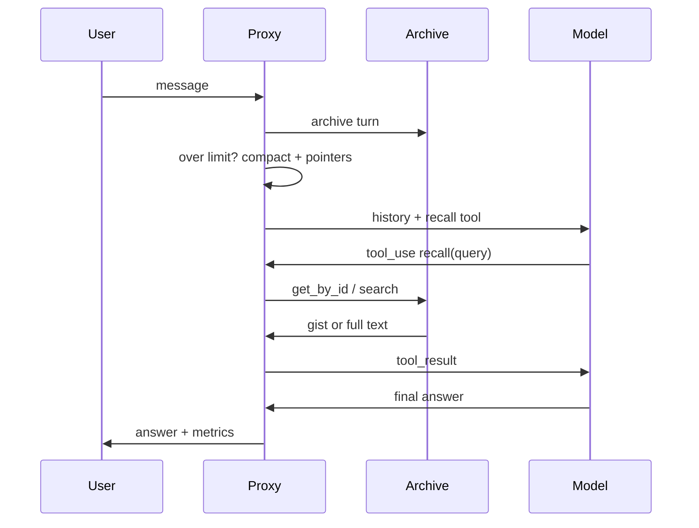

# Rewind: Learning and Implementation Guide

2026-09-18 · Live version: https://claude.ai/code/artifact/152dff03-d895-46cb-a304-24645702f698

> The code in the repository (`src/rewind/`) is the maintained version. Snippets below are the teaching version; where they differ, trust the repository.

## How to use this guide

By the end you will have a working Rewind proxy in Python: it archives context before compaction, recalls it by ID or keyword search, and measures the tokens it saves.

- **Learn first, then build.** The concepts and learning path come first; each build step then uses one concept.
- **Build in order.** Each step runs on its own before you start the next.
- **Code is a starting point.** Snippets use the Anthropic Python SDK and are meant to be read, run and changed. Test each one before you rely on it.
- **Prerequisites:** Python 3.10+, basic async or FastAPI experience, and an Anthropic API key.

## Core concepts

Eight ideas carry the whole project; learn them in this order.

| Concept | What it is | Why Rewind needs it |
| --- | --- | --- |
| Tokens | The units a model reads and writes; billing is per token, and output tokens cost several times more than input (Claude Opus 5: $5 input vs $25 output per million) | Every saving is measured in tokens |
| Context window | The maximum tokens a model sees in one request (1M on current Claude models, 200K on Haiku 4.5) | The limit that forces compaction |
| Compaction | Replacing old turns with a summary to free space; the Claude API also offers built-in server-side compaction (beta) | The step where detail is lost, and where Rewind archives |
| Stateless API | The model remembers nothing between requests; your code resends the history each time | Your proxy controls exactly what the model sees |
| Tool use | The model asks your code to run a function (`tool_use`), and you send back a `tool_result` | How the model calls `recall` |
| Prompt caching | A repeated prompt prefix is billed at a small fraction of the input price; any change in the prefix breaks the cache | Compaction breaks the cache, so design for stable prefixes |
| BM25 | Classic keyword ranking that scores exact word matches | Finds exact identifiers, code and numbers |
| Embeddings | Vectors that place similar meanings close together | Finds paraphrased content (added in the real-system phase) |

**Key insight:** the model never "checks its context and then the database" by itself. Your proxy decides what the model sees, and the `recall` tool lets the model ask for more.

## Learning path

Four weeks of part-time study gets you from basics to a working, measured prototype.

| Week | Study | Practice | Done when |
| --- | --- | --- | --- |
| 1 | Tokens, context windows, the Messages API, token counting | Build a CLI chat that prints token counts each turn | You can predict when the context will fill |
| 2 | Tool use and the agent loop; compaction strategies | Add a toy tool (a calculator), then naive compaction | The model calls a tool and you return the result |
| 3 | BM25, embeddings, hybrid search; read the ARC and MemGPT papers | Index 100 text snippets with `rank_bm25` and query them | Keyword search finds exact identifiers |
| 4 | Prompt caching; evaluation design | Build Steps 1–6 of this guide | The benchmark shows a result against plain compaction |

**Papers to read, in order:** ARC (closest design), Verbatim Chunks Beat Extracted Artifacts (why store raw text), MemGPT (memory tiers), TokenPilot (cache-aware compaction). Links are in Sources.

## System design

Five components, each in its own file, connected through one session object.



**Project layout (teaching version):**

```
rewind/
  config.py       # model, limits, thresholds
  store.py        # Archive: put, get_by_id, search
  compactor.py    # summary + pointer table
  recall.py       # tool definition + handler
  session.py      # chat loop, token counting, metrics
  server.py       # FastAPI endpoints for the UI
  eval/           # benchmark conversations + runner
  data/           # archive.jsonl + objects/
```

**Archive record** (one JSON line per archived chunk):

| Field | Example | Purpose |
| --- | --- | --- |
| `id` | `a3f9c1e2` | First 8 hex characters of the SHA-256 of the text |
| `session` | `demo-1` | Keeps sessions apart |
| `turns` | `[12, 14]` | Where in the conversation it came from |
| `role` | `assistant` | Who wrote it |
| `kind` | `code` | code, text or tool output |
| `gist` | `JWT auth function` | One line shown in pointers and first-level recall |
| `created` | `2026-09-18T10:02:00Z` | Prefer newer facts when they conflict |
| `in_context` | `false` | Avoid recalling what the model already sees |

The full text lives in `data/objects/<id>.txt`, so identical content is stored once.

## Step 1: Setup and chat loop

Goal: a chat loop that counts tokens every turn and knows when it is over the limit.

```bash
python -m venv .venv && source .venv/bin/activate
pip install anthropic rank_bm25 fastapi uvicorn
export ANTHROPIC_API_KEY=...
```

`config.py`:

```python
MODEL = "claude-opus-5"      # swap for a cheaper model if you choose
CONTEXT_LIMIT = 8_000          # small on purpose, so compaction happens fast
KEEP_RECENT_TURNS = 4          # never compact the latest turns
RECALL_MIN_SCORE = 2.0         # BM25 threshold; calibrate in Step 5
DATA_DIR = "data"
```

`session.py` (first version, no archive yet):

```python
import anthropic
from config import MODEL, CONTEXT_LIMIT

client = anthropic.Anthropic()
SYSTEM = "You are a helpful assistant."

class Session:
    def __init__(self, session_id: str):
        self.id = session_id
        self.messages: list[dict] = []
        self.usage = {"input": 0, "output": 0}

    def count_tokens(self) -> int:
        r = client.messages.count_tokens(
            model=MODEL, system=SYSTEM, messages=self.messages
        )
        return r.input_tokens

    def send(self, text: str) -> str:
        self.messages.append({"role": "user", "content": text})
        if self.count_tokens() > CONTEXT_LIMIT:
            print("-- over limit: compaction needed --")
        response = client.messages.create(
            model=MODEL, max_tokens=16000, system=SYSTEM, messages=self.messages
        )
        self.usage["input"] += response.usage.input_tokens
        self.usage["output"] += response.usage.output_tokens
        self.messages.append({"role": "assistant", "content": response.content})
        return next(b.text for b in response.content if b.type == "text")
```

**Check:** chat for 10 turns and watch the "over limit" line appear. Note that `response.content` is appended whole, not just its text, so tool calls survive later.

## Step 2: Archive store

Goal: store text verbatim under a hash ID, fetch it by ID, and search it by keyword, with no database.

`store.py`:

```python
import hashlib, json, os, re
from datetime import datetime, timezone
from rank_bm25 import BM25Okapi
from config import DATA_DIR

def tokenize(text: str) -> list[str]:
    # keeps identifiers like get_user_id and numbers like 4096 intact
    return re.findall(r"[A-Za-z0-9_]+", text.lower())

class Archive:
    def __init__(self):
        os.makedirs(f"{DATA_DIR}/objects", exist_ok=True)
        self.log_path = f"{DATA_DIR}/archive.jsonl"
        self.records: dict[str, dict] = {}
        if os.path.exists(self.log_path):
            with open(self.log_path) as f:
                for line in f:
                    r = json.loads(line)
                    self.records[r["id"]] = r
        self._rebuild_index()

    def put(self, text: str, **meta) -> str:
        cid = hashlib.sha256(text.encode()).hexdigest()[:8]
        if cid not in self.records:            # dedupe: same text, same id
            with open(f"{DATA_DIR}/objects/{cid}.txt", "w") as f:
                f.write(text)
            record = {"id": cid, "created": datetime.now(timezone.utc).isoformat(), **meta}
            with open(self.log_path, "a") as f:
                f.write(json.dumps(record) + "\n")
            self.records[cid] = record
            self._rebuild_index()
        return cid

    def get_by_id(self, cid: str) -> str | None:
        path = f"{DATA_DIR}/objects/{cid}.txt"
        return open(path).read() if os.path.exists(path) else None

    def search(self, query: str, session: str, k: int = 3) -> list[tuple[str, float]]:
        ids = [i for i in self._ids if self.records[i].get("session") == session]
        if not ids:
            return []
        scores = self._bm25.get_scores(tokenize(query))
        ranked = sorted(
            ((i, scores[self._ids.index(i)]) for i in ids),
            key=lambda x: x[1], reverse=True,
        )
        return ranked[:k]

    def _rebuild_index(self):
        self._ids = list(self.records)
        corpus = [tokenize(self.get_by_id(i) or "") for i in self._ids] or [[""]]
        self._bm25 = BM25Okapi(corpus)
```

**Check:** `put` the same text twice and confirm one file and one log line. Search for an identifier from a stored snippet and confirm it ranks first.

**Note:** rebuilding the index on every `put` is fine for a few thousand chunks. Past that, rebuild in batches or move to SQLite FTS5 (see the real-system section).

## Step 3: Compactor with pointers

Goal: when over the limit, archive the oldest turns verbatim, then replace them with a summary plus a pointer table.

**Rules that prevent subtle bugs:**

- Cut only before a user message whose content is plain text. Never separate a `tool_use` from its `tool_result`.
- Always keep the latest `KEEP_RECENT_TURNS` turns.
- Put the summary at the start of the first kept user message, so the history still begins with a user turn.

`compactor.py`:

```python
from config import MODEL, KEEP_RECENT_TURNS

def to_text(msg) -> str:
    content = msg["content"]
    if isinstance(content, str):
        return f"{msg['role']}: {content}"
    parts = []
    for b in content:
        b = b if isinstance(b, dict) else b.model_dump()
        if b["type"] == "text":
            parts.append(b["text"])
        elif b["type"] == "tool_use":
            parts.append(f"[called {b['name']}({b['input']})]")
        elif b["type"] == "tool_result":
            parts.append(f"[tool result: {b['content']}]")
    return f"{msg['role']}: " + "\n".join(parts)

def find_cut(messages) -> int:
    # latest safe cut that still keeps KEEP_RECENT_TURNS messages
    for i in range(len(messages) - KEEP_RECENT_TURNS, 0, -1):
        m = messages[i]
        if m["role"] == "user" and isinstance(m["content"], str):
            return i
    return 0

def compact(session, archive, client) -> None:
    cut = find_cut(session.messages)
    if cut == 0:
        return
    old, keep = session.messages[:cut], session.messages[cut:]

    pointers = []
    for i in range(0, len(old), 2):                  # one chunk per user+assistant pair
        text = "\n\n".join(to_text(m) for m in old[i:i + 2])
        gist = text.split("\n")[0][:80]              # upgrade: ask the model for a gist
        cid = archive.put(text, session=session.id, turns=[i, i + 1],
                          gist=gist, in_context=False)
        pointers.append(f"§{cid} → {gist}")

    resp = client.messages.create(
        model=MODEL, max_tokens=2000,
        messages=[{"role": "user", "content":
            "Summarize this conversation in under 200 words. Keep decisions, "
            "names and open tasks. Do not copy code.\n\n"
            + "\n\n".join(to_text(m) for m in old)}],
    )
    summary = next(b.text for b in resp.content if b.type == "text")

    header = ("[Earlier conversation, compacted]\n" + summary +
              "\n\n[Archived details — call recall with an id for exact text]\n" +
              "\n".join(pointers))
    first = keep[0]
    keep[0] = {"role": "user", "content": header + "\n\n---\n\n" + first["content"]}
    session.messages = keep
```

In `Session.send`, replace the "over limit" print with `compact(self, archive, client)`.

**Check:** after compaction, open `data/archive.jsonl` and confirm each pointer ID in the summary has a matching record and object file.

## Step 4: Recall tool and retriever

Goal: the model can fetch archived content by ID, or by keyword search when it has no ID, gist first and full text on request.

`recall.py`:

```python
from config import RECALL_MIN_SCORE

RECALL_TOOL = {
    "name": "recall",
    "description": (
        "Fetch earlier conversation content that was compacted out of context. "
        "Use it when the user refers to something discussed earlier that you "
        "cannot see in full, such as exact code, numbers, names or decisions. "
        "Pass an id from the [Archived details] list when one matches; otherwise "
        "pass a keyword query. Ask for level 'gist' first and 'full' only when "
        "you need the exact text. If the result says NOT_FOUND, the content was "
        "never archived, so produce it fresh."
    ),
    "input_schema": {
        "type": "object",
        "properties": {
            "id": {"type": "string", "description": "Archive id, without the § sign"},
            "query": {"type": "string", "description": "Keywords to search for"},
            "level": {"type": "string", "enum": ["gist", "full"]},
        },
    },
}

def handle_recall(inp: dict, archive, session_id: str, metrics: dict) -> str:
    level = inp.get("level", "gist")
    cid = (inp.get("id") or "").lstrip("§")
    if cid and cid in archive.records:
        metrics["hits_by_id"] += 1
        rec = archive.records[cid]
        return archive.get_by_id(cid) if level == "full" else f"§{cid}: {rec['gist']}"

    results = archive.search(inp.get("query", ""), session=session_id)
    results = [(i, s) for i, s in results if s >= RECALL_MIN_SCORE]
    if not results:
        metrics["misses"] += 1
        return "NOT_FOUND: nothing archived matches. Generate the answer fresh."
    metrics["hits_by_search"] += 1
    best = results[0][0]
    if level == "full":
        return archive.get_by_id(best)
    return "\n".join(f"§{i}: {archive.records[i]['gist']}" for i, _ in results)
```

**Update `Session.send` into a tool loop:**

```python
def send(self, text: str) -> str:
    self.messages.append({"role": "user", "content": text})
    if self.count_tokens() > CONTEXT_LIMIT:
        compact(self, archive, client)
    while True:
        response = client.messages.create(
            model=MODEL, max_tokens=16000, system=SYSTEM,
            tools=[RECALL_TOOL], messages=self.messages,
        )
        self.usage["input"] += response.usage.input_tokens
        self.usage["output"] += response.usage.output_tokens
        self.messages.append({"role": "assistant", "content": response.content})
        if response.stop_reason != "tool_use":
            return next((b.text for b in response.content if b.type == "text"), "")
        results = [
            {"type": "tool_result", "tool_use_id": b.id,
             "content": handle_recall(b.input, archive, self.id, self.metrics)}
            for b in response.content if b.type == "tool_use"
        ]
        self.messages.append({"role": "user", "content": results})
```

Add `self.metrics = {"hits_by_id": 0, "hits_by_search": 0, "misses": 0}` in `__init__`.

**Check:** plant a function early, chat until it is compacted, then ask "show me the exact function from earlier". The model should call `recall` with the pointer ID and `level: full`, and return the original code.

## Step 5: The generate-new threshold

Goal: pick the BM25 score below which a search counts as a miss, so the model generates fresh instead of using a wrong match.

BM25 scores have no fixed scale; they depend on corpus size and query length. Calibrate on your own data:

1. Build 30 labelled queries: 15 that should hit a known archived chunk, and 15 about things never discussed.
2. Run each query through `archive.search` and record the top score.
3. Try thresholds across the score range and count errors for each.

| Error | What happens | Cost |
| --- | --- | --- |
| False hit (score above threshold, wrong chunk) | Model uses irrelevant or stale content | Wrong answers; worst case |
| False miss (score below threshold, right chunk existed) | Model regenerates content it could have recalled | Wasted output tokens |

4. Choose the threshold with the fewest false hits while false misses stay acceptable. Prefer false misses: they cost tokens, false hits cost correctness.

**Remember failed searches.** Store each NOT_FOUND query per session. If the model repeats the same query, return NOT_FOUND immediately without searching, and count it in the metrics.

## Step 6: Metrics and evaluation

Goal: prove, with numbers, that Rewind answers as well as or better than plain compaction for fewer tokens.

**Benchmark design ("needle in conversation"):**

1. Write 10 scripted conversations of 30–40 turns each.
2. Plant 3–4 facts early in each: a code function, an exact number, a name and role, a decision with its reason.
3. Add filler turns until compaction has happened at least twice.
4. End with questions about each planted fact, plus 2 questions about things never discussed.
5. Grade each answer as exact, partially correct or wrong. Use exact string match for code and numbers, and a model grader or yourself for the rest.

**Setups to compare (same model, same conversations):**

| Setup | What it shows |
| --- | --- |
| No compaction, large limit | The best possible accuracy |
| Plain compaction | The baseline you must beat |
| Recent window + running summary | The simple alternative from the literature |
| Rewind | Your system |

**Metrics to report:**

| Metric | How to compute |
| --- | --- |
| Answer accuracy | Exact answers ÷ questions |
| Input and output tokens | Sum of `response.usage` over the run |
| Estimated cost | Tokens × the model's per-token prices |
| Recall hit rate | (ID hits + search hits) ÷ recall calls |
| False hit and false miss rates | From the labelled questions |
| Tokens per correct answer | Total tokens ÷ exact answers; the headline number |

Run each setup at least 3 times; model output varies between runs, so report the average and the range.

## Taking it to a real system

The prototype proves the idea; a real deployment needs the upgrades below, roughly in this order.

| Area | Prototype | Real system | When to switch |
| --- | --- | --- | --- |
| Storage | JSONL + files | SQLite (FTS5 + sqlite-vec), then PostgreSQL (pgvector + full-text search) | Concurrent writers, crash safety, or over ~100k chunks |
| Search | BM25 only | Hybrid: BM25 + embeddings, then a reranker | Users paraphrase instead of repeating keywords |
| Gists | First line of text | A model-written one-line gist per chunk | Pointers become hard to match |
| Recall levels | Gist or full | Pointer, gist, summary, full | Full text is often more than needed |
| Prompt caching | None | Keep the prefix stable, compact in fixed blocks, add retrieved text at the end; check `usage.cache_read_input_tokens` | Once the cost numbers matter |
| Eviction | Oldest first | Score by likelihood of reuse and cost to regenerate | After the benchmark shows which content gets recalled |
| Stale facts | Newest wins by timestamp | Mark superseded chunks; optionally a temporal knowledge graph | Facts change during long projects |
| Integration | Own chat UI | HTTP proxy for any client, and an MCP server exposing `recall` | When others want to use it |

**Security and privacy (required before real users):**

- Isolate every user and session: filter every query by session and user, and in PostgreSQL enforce it with row-level security.
- Treat archived text as untrusted data. A recalled chunk can contain instructions injected earlier; wrap it clearly as quoted content.
- Encrypt the archive at rest, and set a retention period with automatic deletion.
- Detect and redact secrets and personal data (API keys, passwords, IDs) before archiving.
- Log recall calls for auditing, without logging the content itself.

**Built-in API features to evaluate against:** the Claude API offers server-side compaction, context editing that clears old tool results, and a memory tool (all or partly beta). Compare Rewind against them rather than assuming they don't exist.

## Testing checklist

- [ ] Storing the same text twice creates one file and one log line
- [ ] `get_by_id` returns the exact original text, byte for byte
- [ ] Search never returns chunks from another session
- [ ] Compaction never separates a `tool_use` from its `tool_result`
- [ ] Compaction keeps the latest turns untouched
- [ ] Every pointer in a summary resolves to a stored record
- [ ] Recall by ID returns the gist by default and full text on `level: full`
- [ ] A query about something never discussed returns NOT_FOUND
- [ ] Restarting the proxy reloads the archive and recall still works
- [ ] Token and cost metrics match the sum of `response.usage`
- [ ] Benchmark run completes for all four setups and saves results to a file

## Sources

- [Addressable Recall Compaction (ARC), arXiv 2607.25066](https://arxiv.org/html/2607.25066)
- [Verbatim Chunks Beat Extracted Artifacts, arXiv 2601.00821](https://arxiv.org/abs/2601.00821)
- [TokenPilot: Cache-Efficient Context Management for LLM Agents, arXiv 2606.17016](https://arxiv.org/pdf/2606.17016)
- [Zep: A Temporal Knowledge Graph Architecture for Agent Memory, arXiv 2501.13956](https://arxiv.org/abs/2501.13956)
- [AI Agent Memory 2026: Mem0, Zep, Graphiti, Letta, LangMem compared (covers MemGPT/Letta)](https://medium.com/@wasowski.jarek/i-compared-5-ai-agent-memory-systems-across-6-dimensions-none-wins-6a658335ed0a)
- [Context Compaction for AI Agents, Redis](https://redis.io/blog/context-compaction/)
- Model prices and API shapes: Anthropic Claude API reference, as of this doc's date
